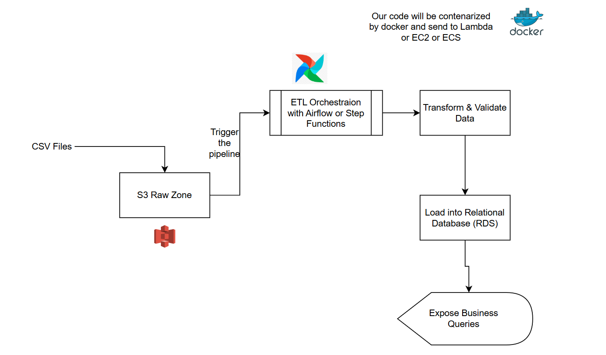

## Intermediate Data Engineer test
### Context
A supermarket stores its transaction data in a relational database for further analysis. The transaction data is uploaded to the system as a CSV file multiple times per day. Each transaction has a unique `id`. As a data engineer, your task is to implement and maintain a pipeline to store the transaction data in the database.

### Elements
For the test, the following elements are provided:
- A sqlite database contains historical transactions data
- A csv file `retail_15_01_2022.csv` contains transaction data of 15/01/2022.
- The tax for all products is 20%.

---

### The implementation of the ETL workflow 

I changed the structure of the initial project as described below : 


```
project_folder/
│
├── data/
│   ├── database/              # SQLite database storage
│   │   └── retail.db
│   └── raw/                   # Raw CSV files
│       └── retail_15_01_2022.csv
│
├── src/
│   ├── etl/                   # ETL pipeline modules
│   │   ├── __init__.py
│   │   ├── extract.py         # Data extraction from CSV
│   │   ├── transform.py       # Data transformation & validation
│   │   └── load.py            # Data loading to database
│   │
│   ├── queries/                          # SQL queries for business insights
│   │   ├── q1_total_transactions.sql
│   │   ├── q2_total_amount.sql
│   │   └── q3_balance.sql
│   │
│   ├── run_etl.py             # ETL pipeline execution script
│   └── run_queries.py         # Business queries execution script
│
├── tests/                     # Unit tests
│   ├── test_etl.py            # Tests for ETL pipeline
│   └── test_queries.py        # Tests for queries
│
├── requirements.txt           # Python dependencies
└── README.md                  # Project documentation
```

---

## The ETL workflow : 

The new project structure consists of having a folder for etl modules in src folder, each file contains the functions of each step , from extracting , transforming and loading data to the final destination (retail.db) in our case. 

1- Extract step :

As first analysis , I noticed that the csv file doesnt have a date column . But we can extract it from the name of each csv file. Assuming that csv files that will arrive will have this structure in their name , we can always extract the date of the day from the file name and then we can add it later in the transofrmation part.The rest is to just extarct tha data as dataframe. I choose to use sqlite3 and pandas as I'm famailiar with these tools but we can imaging using sqlalchemy as well.

2- Transform step :

This step consists of adding the date column as said, renaming also the description that represents the name of products and also reordering the columns in order to match the same order as the target table in the database. 

We can also imagine other kind of transformations for this use cas , like type validation for numeric columns for example , verifiying the tax calculation , removing duplicates etc.

3- Load step : 

This step consists of verifiying first that we dont have some duplicated rows by comparing the unique id of our datafarme (csv file) and the target table ind the database . After that we can insert the new rows to the datbase.


In the src directory , we have run_etl.py file that is responsible to run our ETL pipeline. It takes in the arguments the path of the csv file and the path of database. 
In my project structure here, I created a data foler where we can find a database foler containing the retail database and onther folder named raw where we can find csv files.

To run the pipeline we can run the command : 

``` python .\src\run_etl.py --file data/raw/retail_15_01_2022.csv --db data/database/retail.db ```


### Unit tests for the workflow 

As implementation is only half of the work for a Data Engineer, we are asked to implement test cases to verify things work as expected. An example of test is provided in the file `test.py` . I used the same logic in the `tests/` directory where we can find the `test_etl.py`. This file contains all the unit tests of the functions used in the etl workflow . We could also follow the same logic as the scripts of the etl modules , making a test file for each step test_extract , test_transorm ..etc. but I defined the necessary tests in one file in order to not create a lot of files. 

The testing is based on what we have already as data (the csv file and the sqlite database) but we could imagine to create temporary files in order to add more relevant tests. 

to run the etl tests : 

``` python .\tests\test_etl -v  ```

---

## Explore the data using SQL
For that ,  I created in src the queries where we can find .sql file for each question's query . These queries will be called in a `run_queries.py`  file in order to run and see the results. 

The functions defined in this file , consist of exposing the results to the user when we run.

``` python .\src\run_queries.py ```

Note that , we could export the results as json files or csv for example. That's why for the answer of the question 3 , I choose to return a list of dictionnaries. We could also imagine to deploy and API (FastApi) that will output the results to the user.

### Unit tests for the queries 

In the the folder `tests/` we fin also the `test_queries.py` file where I defined the necessary tests for the queries. Also , I worked with the data that we have but we can create temporary database , in order to add more tests.

To run the unit tests for the queries : 

```  python .\tests\test_queries.py -v ```

---

### Deployment (optional)
Of course, the workflow cannot run on the developer's machine, we need to deploy it and automate the process. 

#### 1. Containerization

To avoid dependency conflicts and ensure reproducibility, the project must be **dockerized**.

We use:

- `requirements.txt` — Python dependencies  
- `Dockerfile` — used to build a consistent image  

This allows the workflow to run inside a Docker container with the same environment every time.

#### 2. Data Locations

In local development, the workflow reads CSV files from local folders.  
In production, input data will likely come from:

- a remote server filesystem  
- a **data lake** (e.g., AWS S3)

The destination database will also be a production system, hosted on-premise or in the cloud (e.g., AWS RDS)

Multiple CSV files may arrive frequently, and the ETL must ingest them automatically. This affects both the **code structure** and the **architecture**.

Here is suggested components to consider for sush scenarios : 

#### 3. Recommended Architecture


  - CSV files land in a RAW zone of a datalake ( AWS S3 for example) 
  - Our ETL pipeline must run regularly (Orchestreted by and Airflow for example or step functions) :

So for example , the code must be deployed in an EC2 where we will have AIRFLOW (the webserver, the scheduler, the postegresql db), and for this we will need to use docker-compose for our project to build the images or to deploy it in a serverless lambda in AWS , trigger the lambda each time a new file arrive in the datalake. The choice of the solutions depends on many factors :  file arrival frequency , processing complexity , expected traffic and scalability needs

  - The ETL pipeline extracts CSV files, transforms them, and loads them into a relational database such as  **AWS RDS** (PostgreSQL, MySQL, etc.)


  - After the data is processed and stored:
Business queries can be exposed via an API ,a service (e.g., **FastAPI** or via API Gateway or a Dashboard ) can be deployed to provide endpoints for analytics or reporting


#### 4. Best Practices

- Replace all `print()` statements with proper **logging** using Python’s `logging` module.
- Use **SQLAlchemy** instead of `sqlite3` for better reliability, consistency, and compatibility with production databases.
- Store sensitive credentials using:
  - environment variables 
  - AWS credentials ... etc


---

Summary Architecture Diagram : 

{width="300"}